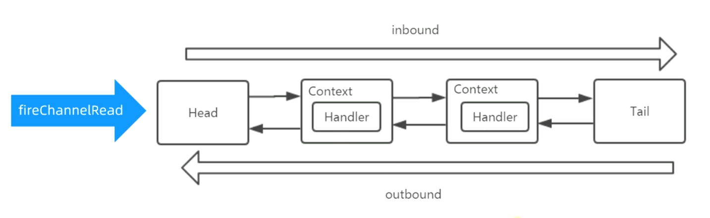

# 业务处理

## 主线

worker thread

Handler 执行资格

- 实现了 ChannelInboundHandler
- 实现方法 channelRead 不能加注解 `@Skip`

## 知识点

1. 处理业务本质：数据在 pipeline 中所有的 handler  的 channelRead() 执行过程
   - Handler 要实现 io.netty.channel.ChannelInboundHandler#channelRead(ChannelHandlerContext ctx, Object msg)，且不能加注解 `@Skip` 才能被执行到
   - 中途可退出，不保证执行到 Tail Handler

2. 默认处理线程就是 Channel 绑定的 NioEventLoop 线程，也可以设置其他：

   `pipeline.addLast(new UnorderedThreadPoolEventExecutor(10), serverHandler)`