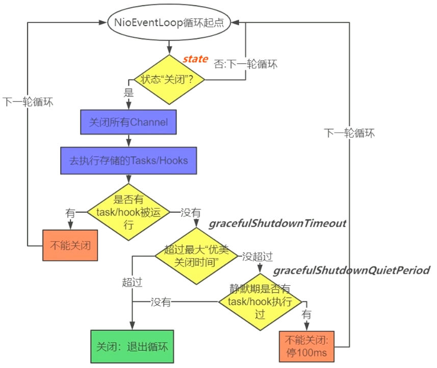

# 关闭服务

## 主线

- bossGroup.shutdownGracefully();

  workerGroup.shutdownGracefully();

  关闭所有 Group 中的 NioEventLoop：

  - 修改 NioEventLoop 的 State 标志位
  - NioEventLoop 判断 State 执行退出

## 知识点

1. 关闭服务的本质：
   - 关闭所有的连接及 Selector：
     - java.nio.channels.Selector#keys
       - java.nio.channels.spi.AbstractInterrupibleChannel#close
       - java.nio.channels.SelectionKey#cancel
     - selector.close()
   - 关闭所有线程：退出循环体 for(;;)

2. 关闭服务的要点：
   - 优雅（DEFAULT_SHUTDOWN_QUIET_PERIOD）
   - 可控（DEFAULT_SHUTDOWN_TIMEOUT）
   - 先不接活，后尽量干完手头的活（先关 boss 后关 worker：不是 100% 保证）