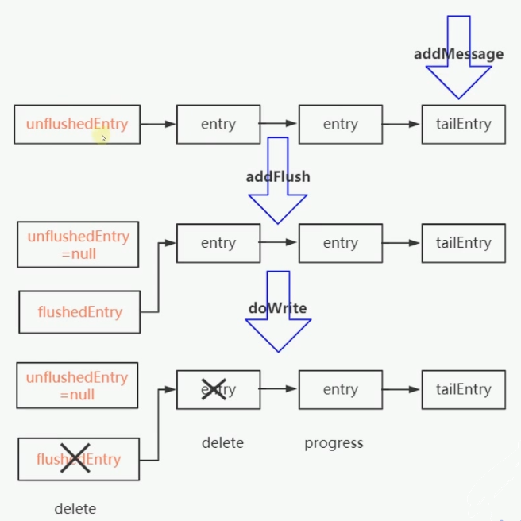

# 发送数据

## 写数据的三种方式

| 快递场景（包裹）               | Netty写数据（数据）                           |
| ------------------------------ | --------------------------------------------- |
| 揽收到仓库                     | write：写到一个 buffer                        |
| 从仓库发货                     | flush：把 buffer 里的数据发送出去             |
| 揽收到仓库并立马发货（加急件） | writeAndFlush：写到 buffer，立马发送          |
| 揽收与发货之间有个缓冲的仓库   | Write 和 Flush 之间有个 ChannelOutboundBuffer |

## 写数据要点

1. 对方仓库爆仓时，送不了的时候，会停止送，协商等电话通知什么时候好了，再送

   Netty 写数据时，写不进去时，会停止写，然后注册一个 OP_WRITE 事件，来通知什么时候可以写进去了再写

2. 发送快递时，对方仓库都直接收下，这个时候再发送快递时，可以尝试发送更多的快递试试，这样效果更好

   Netty 批量写数据时，如果想写的都写进去了，接下来的尝试写更多（调整 **maxBytesPerGatheringWrite**）

3. 发送快递时，发到某个地方的快递特别多，我们会连续发，但是快递车毕竟有限，也会考虑下其他地方

   Netty 只要有数据要写，且能写得出去，则一直尝试，直到写不出去或满 16 次（**writeSpinCount**）

4. 揽收太多，发送来不及时，爆仓，这个时候会出个告示牌：收不下了，最好过两天再来邮寄

   Netty 待写数据太多，超过一定的水位线（**writeBufferWaterMark.high()**），会将可写的标志位改为 false ，让应用端自己决定要不要发送数据了

## 主线

- Write - 写数据到 buffer：

  ChannelOutboundBuffer#addMessage

- Flush - 发送 buffer 里面的数据：

  AbstractChannel.AbstractUnsage#flush

  - 准备数据：ChannelOutboundBuffer#addFlush
  - 发送：NioSocketChannel#doWrite

## 知识点

1. 写的本质

   - Single write：sun.nio.ch.SocketChannelImpl#write(java.nio.ByteBuffer)
   - gathering write：sun.nio.ch.SocketChannelImpl#write(java.nio.ByteBuffer[], int, int)

2. 写数据写不进去时，会停止写，注册一个 **OP_WRITE** 事件，来通知什么时候可以写进去了

3. **OP_WRITE 不是说有数据可写，而是说可以写进去**，所以正常情况，不能注册，否则一直触发

4. 批量写数据时，如果尝试的都写进去了，接下来会尝试写更多（**maxBytesPerGatheringWrite**）

5. 只要有数据要写，且能写，则一直尝试，直到 16 次（**writeSpinCount**），写 16 次还没有写完，就直接 schedule 一个 task 来继续写，而不是用注册事件来触发，更加简洁有力

6. 待写数据太多，超过一定的水位线（**writeBufferWaterMark.high()**），会将可写的标志位改为 false ，让应用端自己决定要不要继续写

7. channelHandlerContext,channel().write()：从 TailContext 开始执行

   channelHandlerContext.write()：从当前的 Contex 开始